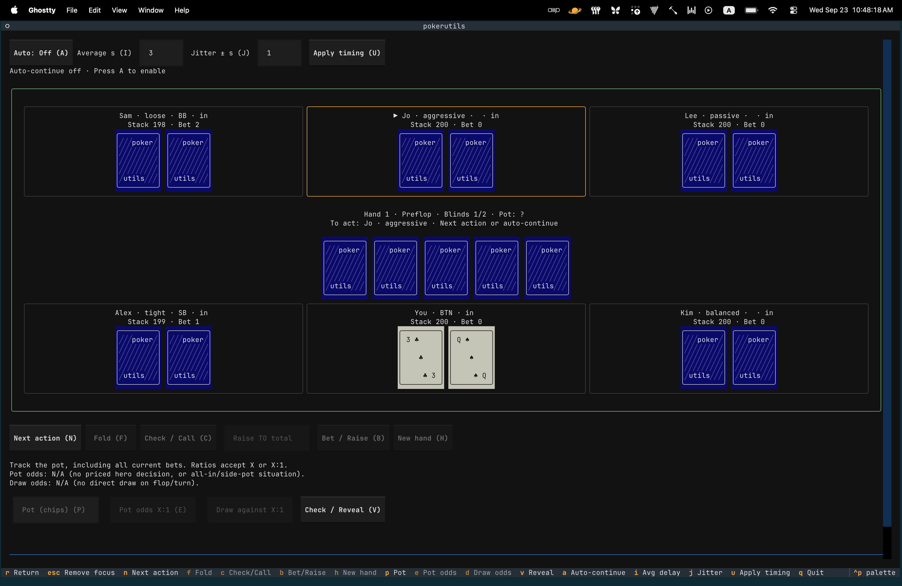
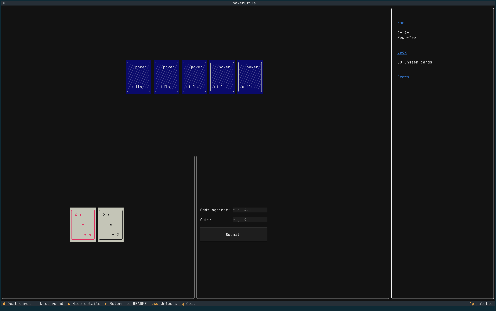

# pokerutils

A terminal app for practicing Texas Hold'em hand reading — deal a hand, reveal the board street by street, and see your hand strength, draws, and odds update live.

## Features

- Deals hole cards and a full community board from a shuffled deck
- Reveals the flop, turn, and river one street at a time
- Evaluates your best five-card hand (pair through straight flush, with set-vs-trips and made-straight naming)
- Detects live draws — flush, straight, gutshot, double gutshot, and backdoor draws — with out counts, hit chance, and odds against
- Remembers your chosen color theme between sessions
- Six-seat no-limit Texas Hold'em table trainer with five simulated opponents, legal betting, blinds, and payouts

## Screenshots

| Table trainer | Outs and odds |
| --- | --- |
|  |  |

## Controls

| Key      | Action                   |
| -------- | ------------------------ |
| `d`      | Deal a fresh hand        |
| `n`      | Reveal the next street   |
| `s`      | Show / hide draw details |
| `o`      | Open the odds exercise   |
| `t`      | Open the table trainer   |
| `r`      | Return to the README     |
| `escape` | Clear focus              |
| `q`      | Quit                     |

## Outs and odds exercise

Press `o` from the home screen. You get hole cards and a hidden board; `n` reveals
the flop, then the turn, then the river. Enter the outs and the odds against
hitting on the **next card** and press **Submit** to have them graded against the
widest direct draw. Odds accept `4.2` or `4.2:1`, with a tolerance of 0.1; outs
must be exact. Press `s` to hide the side panel while you work, and again to check
your reasoning against the full breakdown.

## Install

Run it without installing anything, using [uv](https://docs.astral.sh/uv/):

```sh
uvx pokerutils
```

Or install it with `pip` (Python 3.13+):

```sh
pip install pokerutils
```

Or with [Homebrew](https://brew.sh/):

```sh
brew install markosnarinian/tap/pokerutils
```

Then start it with:

```sh
pokerutils
```

### From source

```sh
git clone https://github.com/markosnarinian/pokerutils
cd pokerutils
uv run pokerutils
```

## Table trainer

Press `t` from the home screen. You sit with five simulated opponents with tight,
loose, aggressive, passive, and balanced tendencies. These are lightweight
randomized policies, not live humans or trained human-behavior models; they use
only their own cards and the public board.

- Press `n` or **Next action** to observe one opponent action. On your turn, use
  **Fold**, **Check / Call**, or enter a street-total amount and **Bet / Raise**.

### Table trainer shortcuts

Every control has a key, shown in its label and the footer. Letters work when no
field is focused; `escape` clears focus (and `enter` submits a focused field).
Shortcuts for disabled controls are greyed out.

| Key      | Action                                                              |
| -------- | ------------------------------------------------------------------- |
| `n`      | Next opponent action                                                |
| `f`      | Fold                                                                |
| `c`      | Check / Call                                                        |
| `b`      | Focus the raise field; `enter` bets / raises                        |
| `h`      | New hand                                                            |
| `p`      | Focus the pot answer                                                |
| `e`      | Focus the pot odds answer                                           |
| `d`      | Focus the draw odds answer                                          |
| `v`      | Check / Reveal (`enter` in an answer moves on, then reveals)        |
| `a`      | Toggle auto-continue                                                |
| `i`, `j` | Focus average delay / jitter (`enter` applies timing)               |
| `u`      | Apply timing                                                        |
| `escape` | Clear focus                                                         |
| `r`      | Return to the README                                                |
- Press `a` or **Auto: Off/On** to toggle automatic opponent actions (off by
  default). It pauses for your turn and at hand completion, and resumes after
  your action or when you start a new hand. Leaving the screen stops its timer.
- Set **Average (s)** and **Jitter ± (s)**, then **Apply timing** to override the
  pace. Each delay is sampled uniformly from average − jitter to average + jitter.
  Defaults are 3 ± 1 seconds (2–4 seconds), a practice pace rather than a measured
  human average. Use zero jitter for a fixed delay; the minimum delay must be at
  least 0.1 seconds. Settings last for the current app session. Manual steps and
  timing changes replace the pending timer; pause auto to study between actions.
- Track the pot from the action history, including the small blind (1), big blind
  (2), and outstanding bets. Enter your answer and use **Check / Reveal**.
- At priced decisions, practice pot odds as `pot before calling / cost to call`.
  Feedback also shows break-even equity: `call / (pot + call)`.
- On the flop and turn, an available direct draw supplies an outs count; calculate
  odds against hitting on the **next card**, not by the river. Hidden opponent
  cards are still counted as unseen. Completing a draw does not guarantee winning.
- Ratios accept `4.2` or `4.2:1`, with a tolerance of 0.1; pot totals must be exact.
- All-ins and side pots are settled by the engine, but their pot-odds questions
  are omitted to avoid misleading eligibility calculations. There is no rake.
- After settlement, **New hand** rotates the button and resets all six stacks to
  200 chips (100 big blinds). These are independent drills, not a bankroll session.

Use a terminal at least 110 columns wide for all action controls at once; smaller
terminals can scroll the controls horizontally and the page vertically.

### Engine and historical hands

The rules engine is [PokerKit](https://github.com/uoftcprg/pokerkit), which supports
Python 3.13, arbitrary no-limit sizing, forced blinds, all-ins, side pots, and
showdown settlement. We also considered
[PyPokerEngine](https://github.com/ishikota/PyPokerEngine) (older Python support and
example bots rather than human models) and [RLCard](https://github.com/datamllab/rlcard)
(RL-oriented, abstracted bet sizes, no bundled human-like six-seat NLHE policy).

[Poker Hand History (PHH)](https://phh.readthedocs.io/) is an open, TOML-based
interchange format, not a universal standard used by every poker site.
[PokerKit supports PHH loading and action-by-action replay](https://pokerkit.readthedocs.io/en/stable/notation.html),
as well as parsers for some site-specific histories. Real histories could provide
authentic opponent decisions in a future replay exercise. They may omit hidden
cards, and recorded actions cannot simply continue after the learner takes a
different action. **Import/replay is not implemented in this mode**; no historical
dataset is downloaded or bundled.

## Tests

```sh
PYTHONPATH=src uv run python -m unittest discover -s tests -v
```

## License

Released under the [GNU General Public License v3.0 or later](LICENSE).

## Tech stack

Built with [Textual](https://textual.textualize.io/) for the terminal UI, with preferences persisted via `platformdirs`.
